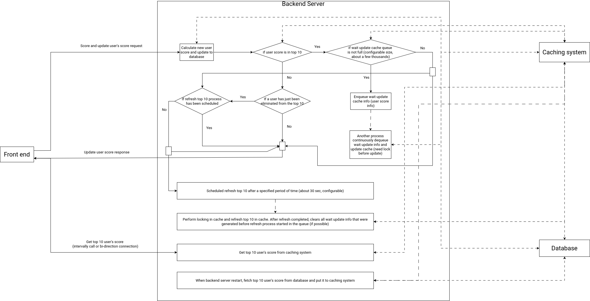

# Score API module

This module is used for scoring user action. The below diagram describe how this module handle client request

## How it works

- Client send request with authorize header to perform actions: update score, get top 10 user's score. All request send with authorize token in header (get token in login step). Update score use http protocol, live update top 10 score use either call http intervally or websocket connection.
- Process flow of module is described in below diagram
- To fast query top 10 user's score when application restart, score column in db may need indexed

